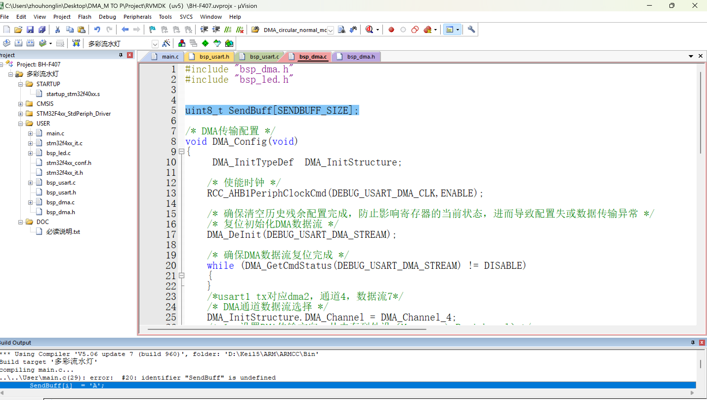

==static使用技巧：==

变量加了static表示此变量只在当前.c文件中有效

==extern：==

声明外部变量，让 其他.c 可以访问

如果在当前.c文件中定义了一个变量，然后如果不希望被其他.c文件中调用，则对应.h文件不允许出现该变量

如果希望此变量能够被其他.c文件调用，则需要在其头文件(.h)中对该变量加extern声明

典型错误：

此时主函数虽然调用了"bsp_dma.h"

但是C 语言的编译器在编译 `main.c` 时，是单个文件独立编译的，他找不到那个SendBuff

所以应该在变量对应头文件中添加extern全局变量声明，让他能够被main.c文件找到

==遇到 undefined 报错，排查步骤：==

1. **含（含头文件了吗？）**
2. **声（写 extern 声明了吗？）**
3. **存（按 Ctrl+S 保存了吗？）**
4. **静（定义处加 static 锁死了吗？）**
