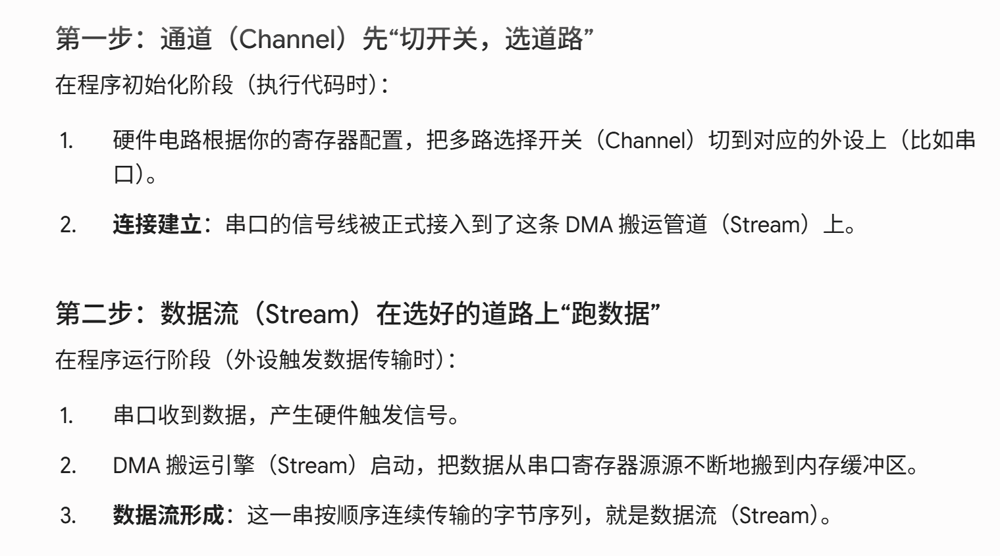
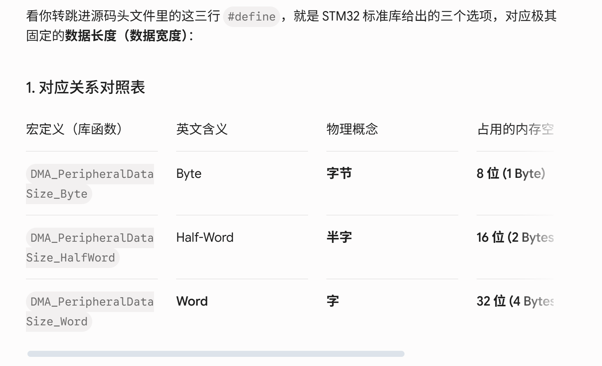

# DMA数据跟通道流

==解释：==数据流就是被通道选择的路，并且同时进行数据传输。就是通道先选择好道路，然后数据流就是在道路上进行数据传输.

==*区别*==

# 数据长度（数据宽度）

==我目标是uint32_t就是配置word如果是uint16_t就是配置HALF==（成立的前提：源端和目标端的数据类型完全一致）

# 关于FIFO的使能与禁止

关于串口（USART）：并不是经过 FIFO 变慢了，而是因为串口太慢，如果开 FIFO，**末尾凑不够阈值（如凑不满 4 个字节）的数据会滞留在 FIFO 缓冲区里发不出去**。为了避免这种数据滞留，所以直接不用 FIFO（直通模式，来 1 个发 1 个）

关于存储器到存储器：用 FIFO **不是为了保证完整性**（不开 FIFO 传输也不会丢字节），而是为了**提高总线利用效率**。因为内存速度极快，开 FIFO 可以启用“突发打包（Burst）”，一口气搬运一大块数据，**减少 DMA 频繁抢占总线的次数**，把总线带宽省下来给 CPU 和其他模块使用。
