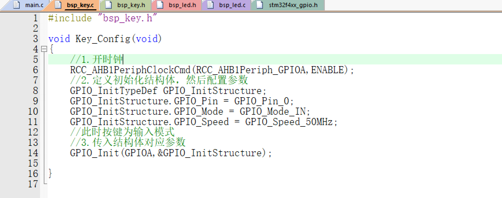

此时已经实现了LED和KEY的初始化，但是需要**实现按键翻转**，还需要继续写

库函数中，有翻转电平的函数。但是只在while(1)中写翻转电平的函数明显不行

这个是由于单片机的程序运行效率很快，所以你只要按住按键不松手，灯就会以极快的速度闪烁。

则此时应当怎么解决让单片机知道我只按了一次。

第一步：一直检测按键有没有按下，如果没有按下，则什么都不要动

第二步：发现按键疑似被按下，按键由低电平变成高电平，但是这个可能是静电引起，则需要等待一会(这个叫按键消抖)

第三步：确认按键按下。等了一会儿后，按键还是高电平则确定是按键被按下了。

​		立刻去执行翻转函数GPIO_ToggleBits(),按一下熄灭，按一下点亮

第四步：一直盯着按键电平

​		因为我还没离开按键，手还按在上面，而单片机执行太快了，如果程序不在这里死等，就会立刻跳回第一步再次检测到高电			平，导致灯疯狂闪烁

第五步：手松开，确认按键引脚由高电平变成低电平，退出程序

最后在while(1)里执行以上操作