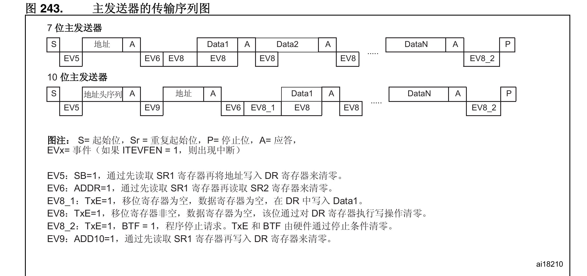
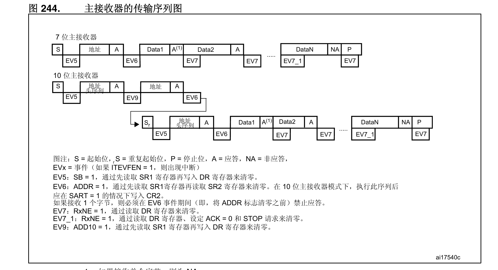

# 硬件I2C配置流程

## 初始化I2C函数

第一步：开GPIO和I2C的时钟

​	初始化GPIO的目的：初始化GPIO就是因为I2C外设的硬件连接到了GPIO，所以要初始化那些GPIO将他						    配置成复用功能给外设使用（把物理引脚的控制权“移交”给内部的 I2C 模块。）

​	所以要查看开发板原理图外设对应的GPIO进行初始化

第二步：引脚复用映射(AF)

第三步：配置 GPIO 参数并 Init       

​		（必须是：复用模式 AF + 开漏输出 OD）

第四步：配置 I2C 参数并 Init       

​		（配置通信速率/SCL时钟频率、主从模式、应答等）

第五步：使能 I2C 外设（I2C_Cmd）       

​		

### 编写I2C往EEPROM读写数据的函数

**I2C往EEPROM写操作**

```
 	/*
 	补充说明
 	以下流程假设函数定义为 EEPROM_Byte_Write(uint8_t addr, uint8_t data)
 	函数调用是这样的，到时候主函数调用函数在addr这个位置的时候就写具体地址了，然后传给SendData这个函数了
 	SendData也就是对应写入存储单元地址
 	*/
 	
 	// 1. 产生起始信号 (START)
    // 2. 检查EV5事件 (SB=1, 起始信号发送成功) (检查事件I2C_CheckEvent)
    // 3. 写入 EEPROM 设备地址(设置为写操作0xA0) 
    // 4. 检查EV6事件 (ADDR=1, 地址发送成功，收到从机应答)
    // 5. 发送要写入存储单元的地址 (addr)(SendData())
    // 6. 检查EV8_2事件 (数据寄存器与移位寄存器均空)
    // 7. 发送要写入存储单元的数据 (data)(SendData())
    // 8. 等待发送完成 (EV8_2)
    // 9. 产生停止信号(STOP)
    // 10. 【关键】等待EEPROM内部擦写完成 (延时5ms或ACK轮询应答)
```

~~~ c
/* 
补充说明：上面第10步【ACK轮询应答】的内部执行逻辑
如果用延时5ms的代码，直接调用 delay_ms(5) 即可。
如果采用更高效的ACK轮询，它的本质其实就是去不断试探EEPROM：
*/


//1. 外循环：设置最大重试次数（防死机，如 count_wait = TIMEOUT）
//2. 产生起始信号（START）
//3. 检查 EV5 事件（SB=1）
//4. 发送EEPROM设备地址，并设置为写操作（0xA0）
//5. 检查 EV6 事件（ADDR=1，看EEPROM是否给出应答）
//6. 如果第5步检测到 EV6 事件（收到ACK），说明烧录结束，立即跳出循环
    /* if (检测到 EV6 事件，即 I2C_EVENT_MASTER_TRANSMITTER_MODE_SELECTED) 
    {
        // 说明 EEPROM 刚烧录完，给予了 ACK 应答！
        break; 
    }*/
//7. 退出前，产生停止信号（STOP）
~~~


参考资料：stm32F407中文参考手册654页，主发送器的传输序列图




**I2C往EEPROM读操作**

~~~ c
/*
补充说明
以下流程假设函数定义为 EEPROM_Byte_Read(uint8_t addr, uint8_t *data)
*/

/* ====== 阶段一：虚写操作，设置内部读取地址指针 ====== */

// 1. 产生起始信号（START）
// 2. 检查EV5事件（SB=1，起始信号发送成功）
// 3. 写入EEPROM设备地址(设置为写操作0xA0)
// 4. 检查EV6事件（ADDR=1，地址发送成功，收到从机应答）
// 5. 发送要读取的存储单元的地址 (addr) (SendData())
// 6. 检查EV8_2事件（数据寄存器与移位寄存器均空，虚拟地址已发送完毕）

/* ====== 阶段二：真正的读取操作 ====== */

// 7. 产生重复起始信号（START）
// 8. 检查EV5事件
// 9. 写入EEPROM设备地址(设置为读操作0xA1)
// 10. 检查EV6事件（ADDR=1，收到应答）
// 根据图244说明：如果是单字节读取，读取SR1、SR2清除EV6标志后，立刻调用库函数关闭应答 (I2C_AcknowledgeConfig(I2C1, DISABLE))，在接收到数据之前直接非应答，把NACK信号传出去
//选择DISABLE是stm32告诉EEPROM传输够了,这是我读取的最后一个字节不需要再发送
// 11. 等待EV7事件（RXNE=1，接收到了数据）
// 12. 读取数据寄存器 (I2C_ReceiveData()) 接收到的数据保存到*data
// 13. 产生停止信号（STOP）
// 14. 【恢复】重新开启应答 (I2C_AcknowledgeConfig(I2C1, ENABLE))，为下一次通信做准备

~~~


参考资料：stm32F407中文参考手册655页，主接收器的传输序列图


