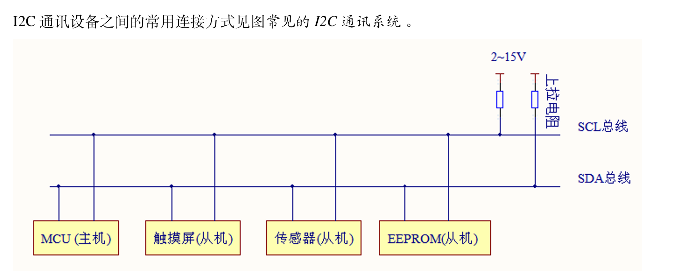
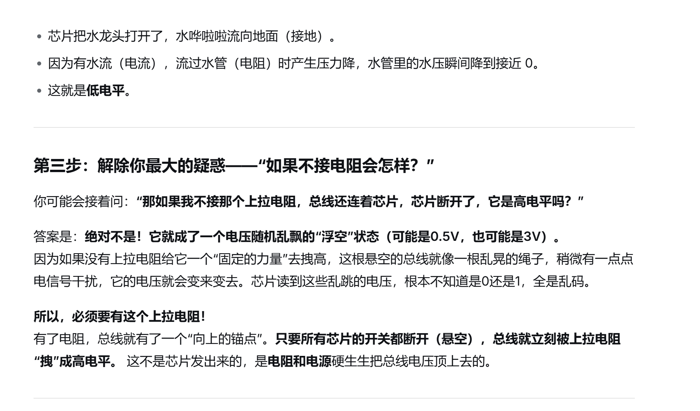

### 第一使命：物理防烧毁（保命）

- **推挽为什么会死**：如果两台设备同时说话，一台想“发1（输出5V）”，一台想“发0（输出0V）”。因为连在同一条线上，这就是**电源和地通过导线直接短接**，瞬间大电流烧毁。
- **开漏怎么活命**：发“1”的设备在开漏模式下，**根本不是“输出”5V，而是“断开开关（松手）”**。它主动放弃了对抗。因为松手了，它绝对不会和发0的设备“硬碰硬”，电流只会从上拉电阻里缓慢流过（仅0.5毫安），**绝对安全**。

### 2. 第二使命：边说话边监听（实现抢话权）

- 如果做不了“监听”，两个主机同时抢话，根本不知道对方也在说。
- **开漏是怎么做到的**：因为开漏模式下，**“发1”就等于“我彻底松手”**。
  - 当A和B同时抢话时，如果A发0（拉低），B发1（松手），B会发现**物理上的总线明明是0V**。
  - B心里咯噔一下：“我自己松手了，按理说应该靠电阻变成5V，可现在线上却是0V？这只有一个解释——**一定有其他人在拉低**。”
  - 立刻，B就乖乖闭嘴退出了。
- **这个“明明没出力，却能读到别人信号”的奇妙能力，只有开漏才有。**

### 3. 第三使命：给慢设备留活路（时钟拉伸）

- 如果从机是个慢性子，处理不过来。从机把SCL（时钟线）拉低，意思是：“等等我，还没算完！”
- **如果主机用推挽**：主机暴脾气，看到线变低了，它立刻启动推挽**强行把线顶回高电平**，直接把从机噎死，数据出错。
- **因为主机用开漏**：主机想去拉高，但它只能“松手”。**它没有主动顶高电平的能力！** 所以它只能乖乖待着，等从机处理完，自己松开引脚，电阻再把线拉高。

**总线（SDA/SCL线）**：是一根实体的金属导线，它**永远**连着上拉电阻（电阻无穷大）和电源。

开漏模式下，设备只有下拉功能

I2C 有根时钟线（SCL），能够决定一个时钟周期内，只能有一个设备（包括所有主机跟从机）有权力“决定拉不拉低”，其他设备只能“乖乖听着”。

当主机在发送数据时（比如发一个“1”）：主机在这个周期里主动选择断开。其他从机在这个周期里根本没有权利去拉低，它们只能安静地读取电压。所以，从机读到高电平，自然就知道“这是主机在发 1”

当从机在回复数据时（比如回一个“1”）：主机在这个周期里断开（把控制权交给从机）。从机在这个周期里松手，主机就读取到高电平，自然就知道“这是从机在回 1”

I2C通讯是主机先发送地址。比如，主机发了一串信号，说：地址是 0x68 的传感器，你听好！，然后对应从机就会接收到信号，进行单独响应，其他设备没有权力去响应。

假如真有两个设备同时抢着发“1”怎么办？（仲裁）

比第一个周期：甲想发“1”（松手），乙也想发“1”（松手）。线是高电平，主机都没发现异常。

比第二个周期：甲想发“1”（还是松手），乙突然想发“0”（拉低）。

1. **物理结果**：乙把线拉成了 0V。此时，甲虽然松手了，但读出总线上的电压是 0V

   甲的发现：甲心里咯噔一下：“奇怪！我明明松手想发 1，怎么线上却是 0？肯定有另一个人同时在说话！”

​	甲的行动：甲立刻明白自己抢话失败，**果断闭嘴退出**，把整个总线让给乙。

当所有设备都断开了（高阻态），由于总线连着一个电源所以是高电压，但是此时由于总线没有连接任何设备

所以即使是高电压，设备也不会被烧坏

- **拉低（变0）**：是芯片主动干活（内部开关闭合，把线连到地）。
- **拉高（变1）**：不是芯片在干活，而是芯片什么都不干（内部开关断开，让线悬空）。线悬空后，被外面那个电阻“拽”成了高电平。

只要有一个设备在“拉低”，整条线就是0V；只有**所有**设备都“断开”时，线才会被外部电阻“拽”成高电平。

开漏中拉低的力量大于断开。总线上的电压变成“0”

如果是输出推挽

1. 甲想喊“1”（往上顶），乙想喊“0”（往下拉）。结果就是**5V和0V硬碰硬**，中间没有任何阻挡，瞬间电流爆炸，两个人都烧冒烟。

​	（由于设备都是连接在同一条总线上都是相通的）

