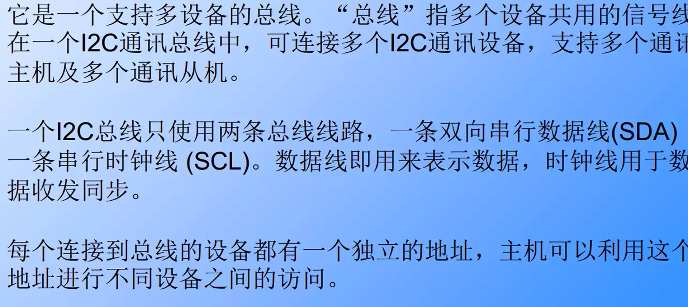
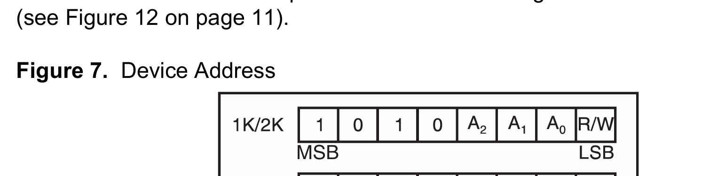
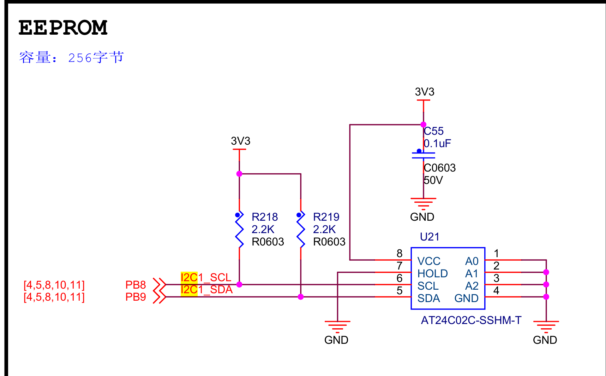
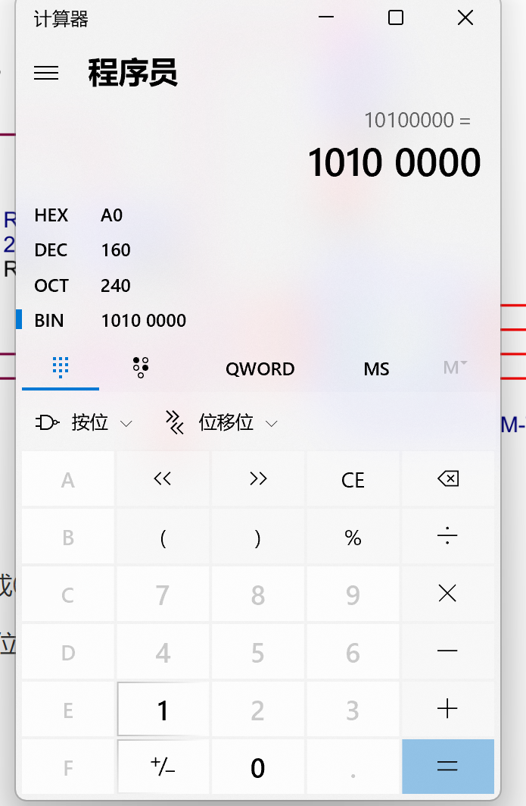

I2C总线

高电平	1	 3.3V

低电平	0	0V

高阻态	1	电阻无穷大

​		    0	0V

高阻态状态只有输出类型配置成输出开漏才有这种模式，输出推挽模式只有高低电平2种状态

# 设备地址的配置

**参考AT24C02**

​	此时设备地址高四位都是固定的为1010，低三位则需要查找EEPROM原理图

**观察EEPROM原理图**，可得观察此时A0,A1,A2都接地所以都应该配置成000

观察此时A0,A1,A2都接地所以都应该配置成000

然后再根据是写(0)还是读(1)，配置最好一位

最后根据计算器算出地址

