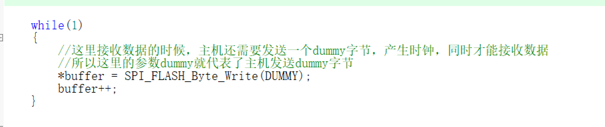

后面的A23-A16，A15-A8，A7-A0就是将擦除扇区的24位地址拆成3份8位数据位

如果将addr赋值为扇区地址，则addr >> 16位(右移16位)，原来addr地址的第 16 位到 23 位，刚好“平移到”了最右侧的第 0 位到第 7 位的位置上。

但 addr 是 32 位的，右移后高 16 位仍然全是 0。后面再加上&0xff，则会截取到右移之后的最低8位

主机发送dummy字节解释

# SPI配置流程

- 准备阶段:定义变量  存储flash_id  存储数据个数 i(如果是4096个字节，选择uint32_t)

- 调用串口及SPI初始化函数

- 检查flash正常,(读取flashID)

  打印开始读取flash_id语句

  flash_id读取数据，调用读取flash_id函数

  如果读取正常，则打印flash_id

- 打印擦除开始语句

- 调用擦除flash扇区函数

- 打印擦除结束语句

- 调用扇区读取数据函数

- 校验读取到的数据是否正确

  for循环读取数据个数，调用Read_Buffer函数，判断读取到的数据是否为0xff

  如果数据不等于0xff，则说明擦除数据失败，打印擦除扇区失败语句

- 准备数据及写入数据

  - for循环要写入的数据个数,调用Write_Buffer函数
  - 打印写入开始语句，调用SPI写入数据函数，打印写入结束语句

- 数据读取及其写入验证

  调用SPI读取数据函数

  for循环打印读取到的数据个数，然后输出数据校验成功

  

## 读取FLASH ID(如厂商和设备号),验证SPI通讯正常

### 第一步：SPI外设初始化

**初始化SPI相关引脚结构体成员配置**

- 打开SPI和GPIO时钟

- GPIO复用映射

 	将PB3/PB4/PB5 的GPIO直接连接到到 SPI1 控制器

- 配置GPIO结构体成员，并Init()传入结构体成员参数

  注意CS引脚选择软件控制，就是程序还要写高低电平的变化，则用输出模式(当做普通IO)

  输出类型选择推挽输出

**初始化SPI工作模式**

- 打开GPIO时钟
- 配置SPI结构体成员参数并Init()

​	NSS片选信号一般选择软件控制

- 使能SPI外设

### 第二步：编写基本的SPI读写单个字节的流程函数

​    **编写基本写单个字节函数**

- 准备阶段：定义一个变量，用来存Flash接收回来的数据(spi发跟收同时进行)

- 等待发送缓冲区为空（TXE标志位）

  防死机保护：加入一个 SPITimeout超时计数器，如果硬件卡住了（比如 SPI 没配置好，一直不发送），			SPITimeout会递减到 0，然后触发错误回调函数，避免程序死循环卡死。

- 写入数据寄存器（SPI_I2S_SendData），启动发送

  在 SPI 硬件发送这个字节的同时，它也在接收线上接收从设备发回来的另外一个字节。

- 等待“接收缓冲区非空”（RXNE 标志）

  循环等到 RXNE变成1

  重新初始化SPITimeout，防止用了前面的超时剩余值，导致这里超时判断不准确

- 变量存储接收到的数据并返回

  **编写基本读单个字节函数**

  要求：识别 Flash 芯片的型号和厂商

  基于W25Q128芯片，命令选择Release Power-down/ID

- 准备阶段:定义变量，存储读取到设备ID号

- 选中 Flash 芯片（片选拉低）

​	GPIO_ResetBits

- 发送命令(设备ID)

- 发送 3 个(Dummy)字节

- 真正读取一个字节（发送Dummy，主机产生时钟，接收数据）

  变量存储读取到的数据

- 片选拉高(结束本次通讯)

- 返回读取到的设备ID号

  

### SPI写入数据到flash流程

 ### 编写擦除扇区函数(flash最小擦除单位就是扇区)

参数选择要擦除扇区的首地址，看指令发现没有要返回的值，所以不需要返回值

- 使能write enable写使能指令

- 拉低CS引脚(表示开始通讯)

- 发送擦除扇区指令代码

- 发送擦除扇区的三个首地址

  flash发送地址时，是由高地址发到低地址，右移高8位，然后中低8位

- 将CS引脚拉成高电平

- 擦除结束操作后需要检测busy位，来确保擦除操作的完成

  编写wait_for_standby函数

### 编写SPI写入扇区函数

- 参数选择 写入数据的起始地址 写入数据的指针 写入数据的个数

- 定义一个变量，用来存储已处理字节数的计数器和循环次数

- 翻页判断条件

  第一次计数 翻页次数 下一页的地址

  - 结束上一次的页写入指令(拉高CS电平 等待内部时序完成)
  - 使能Write_Enable指令
  - 拉低CS电平
  - 发送页写入指令
  - 发送要写入数据的首地址发送

- 发送要写入的数据

- 写入数据指针++  写入数据地址++

- 执行完写入指令，再执行结束指令

  拉高CS电平

  等待内部时序完成

### 编写SPI读取扇区数据函数

传入的参数选择 读取数据地址 存储读取到数据 存储读取数据的个数

- 拉低CS电平
- 发送读取扇区数据指令
- 发送读取数据地址
- 循环读取数据个数

 	接收读取到的数据，同时主机发送DUMMY数据，由此产生时钟

​	读取数据指针(指针存储读取数据的地址)++

​	SPI读与写同时进行

- 拉高CS电平
- 等待内部时序写入完成

-----------------------------------------------------------------------------------------------------------------------------------------------------

## 函数封装

### 封装SPI FLASH写使能命令

- 拉高CS电平
- 发送写使能指令
- 拉高CS电平

### 封装等待内部时序完成命令

- 准备阶段：定义变量，存储SPI FLASH的busy位
- 拉低CS电平
- 发送读取状态指令

- 加个等待超时功能，防止程序死循环

- 循环读取busy位

  - 变量存储读取到的busy状态位，同时SPI发送dummy指令(SPI读与写同时进行)

  - 判断busy位是否空闲(置0)，如果空闲则跳出循环

    (&0x01作用:status 的高 7 位全部变成0,只保留最低的那 1 位)

  - 判断程序是否超时

    如果超时，则退出循环，发送SPI错误回调函数

- 拉高CS电平

  ### 封装SPI错误回调函数

  函数类型选择uint8_t，参数选择 错误码 code

- 打印错误码

- 返回错误状态，如果为0表示错误
