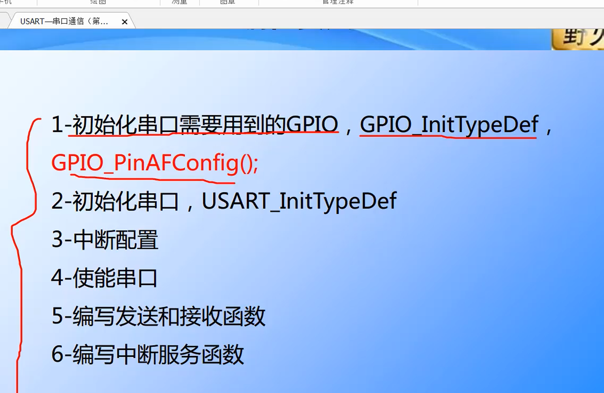

第一步：初始化串口所需要用到的GPIO
1.开GPIO端口时钟:注意数据发送跟接受的引脚是不是都要开启
2.定义结构体，配置TX跟RX的结构体参数
3.建立引脚与外设的具体映射

GPIO_InitTypeDef,GPIO_PinAFConfig()
注意不同串口挂载的时钟总线不一样，所以使能时钟也不一样
串口1跟6是  			RCC_APB2PeriphClockCmd
串口2，3，4，5是 		RCC_APB1 PeriphClockCmd

第二步：初始化串口USART
1.开时钟
2.配置结构体参数

第三步：中断配置

第四步：使能串口

第五步：编写发送和接收函数

第六步：编写中断服务函数

