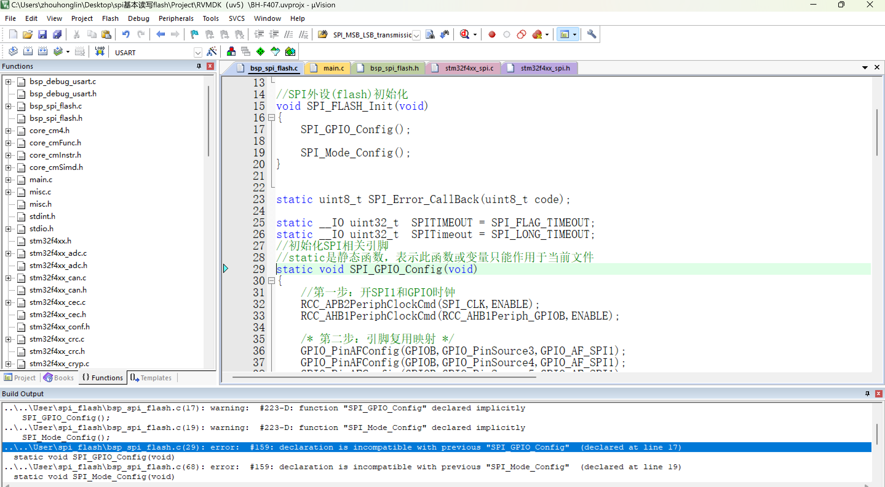

```
编译报错：
..\..\User\spi_flash\bsp_spi_flash.c(29): error:  #159: declaration is incompatible with previous "SPI_GPIO_Config"  (declared at line 17)
错误分析：声明与之前的声明不匹配
```

- 错误原因：这个问题的原因是函数没有提前声明，直接调用了
- C语言遵循**函数先声明，后使用**

 