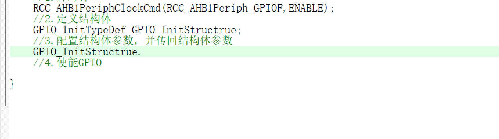

### 结构体配置问题



**错误现象：**结构体.不能弹出对应结构体成员

**错误原因：**外设头文件未包含

```
#include "stm32f4xx.h"
```


## 上拉下拉电阻配置

**含义：**

- 上拉：引脚连接到高电平(如3.3V)；当处于空闲状态时，引脚默认为高电平也就是置1
- 下拉：引脚接地；空闲状态时引脚默认为低电平，置0

**作用：**上/下拉电阻，是为了防止引脚在未受控制时发生“悬空”（电平不稳定、受到电磁干扰乱跳）。