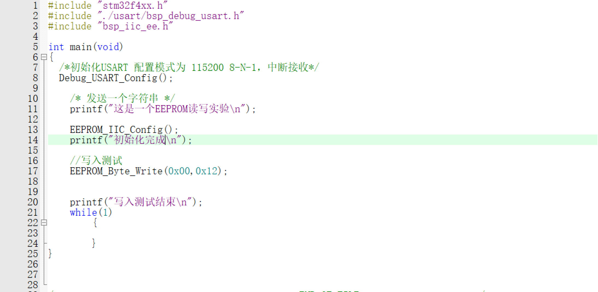
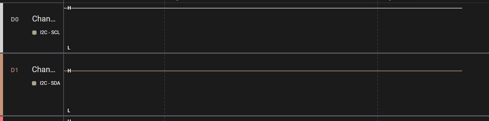
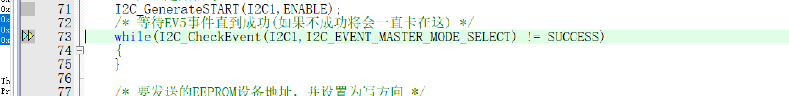
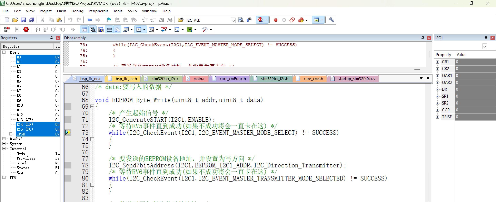
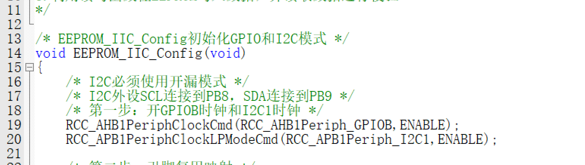
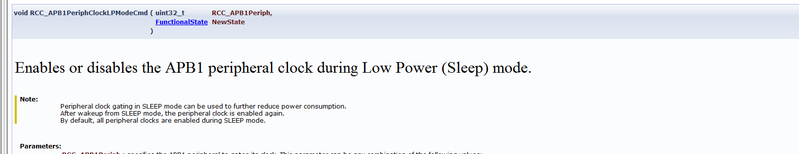
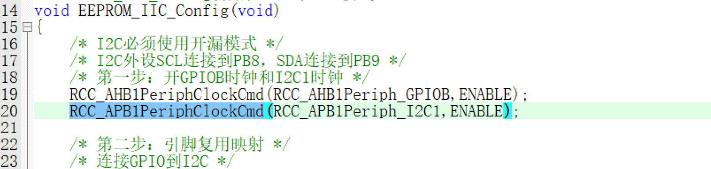
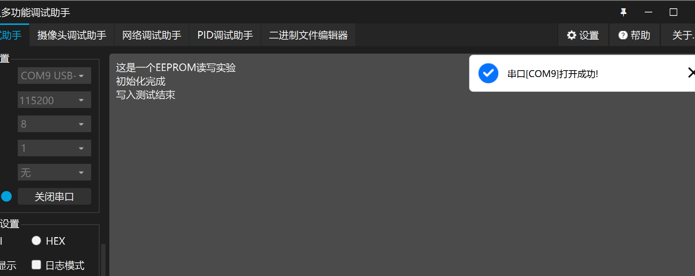
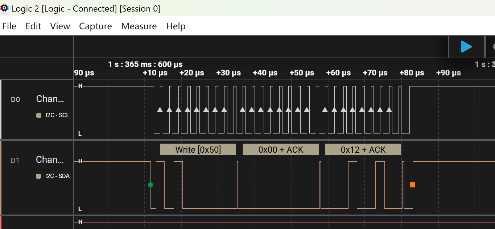

根据主函数设计思想，先打印EEPROM读写实验，接着检测是否I2C初始化成功。

然后I2C写入EEPROM，如果成功写入则会执行下方“写入测试结束”语句

程序现象：“这是一个EEPROM”语句和“初始化完成”正常打印，但是“写入测试结束”语句并未成功执行

说明I2C写入EEPROM失败

# Debug

**逻辑分析仪配置：SCL连接D0，SDA连接D1，频率为8MS/s，下降沿触发**

无任何电平变化

进入debug调试在此行设置断点

~~~
EEPROM_Byte_Write(0x00,0x12);
~~~

单步F11进入EEPROM_Byte_Write进入函数内部，此时代码卡在

查看I2C1寄存器

则可说明此时I2C1外设没有被使用，说明问题大概率是I2C1外设未使能

退出debug，检查I2C1时钟使能代码

仔细观察发现I2C1时钟开启代码多了一点东西

查阅资料可得

RCC_APB1PeriphClockLPModeCmd这个函数解释：

不是使能APB1时钟,只是使能APB1时钟是否在低功耗模式下还运行

修改代码为

重新运行程序

此时显示串口发送数据正常，且正确完整的实现了程序的要求

重新使用逻辑分析仪观测I2C1波形

此时逻辑分析仪波形输出正常

程序代码完美运行成功，I2C1的数据成功写入了EEPROM