### SPI外设未使能

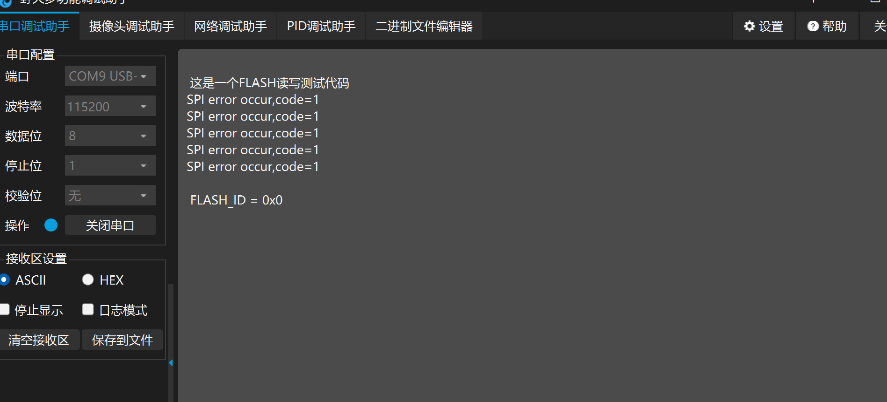

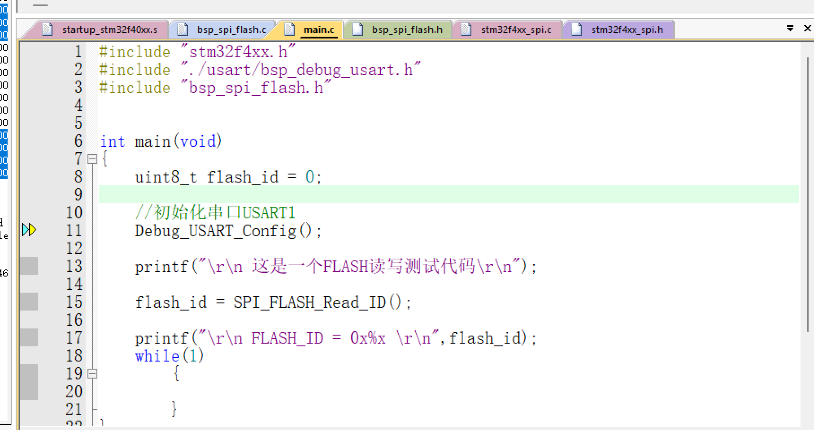

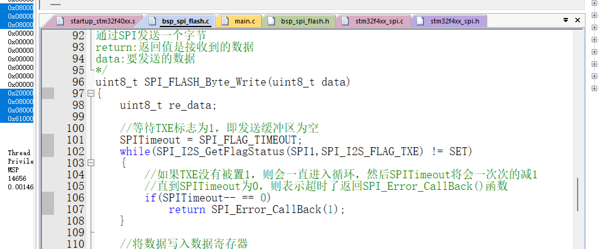

现象分析：串口初始化没有问题，打印正常，错误出现在code 1

在while(SPI_I2S_GetFlagStatus(SPI1,SPI_I2S_FLAG_TXE) != SET)处设置断点，全速运行，程序停留在断点处

翻看参考手册SPI寄存器

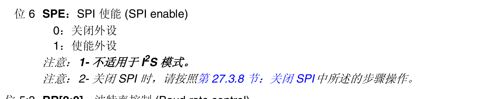

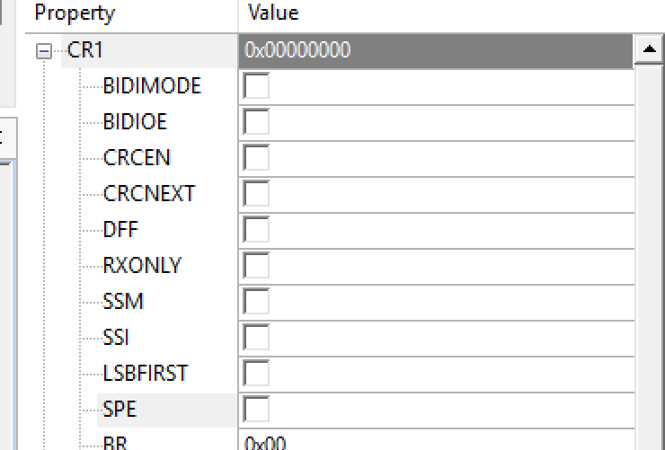

查看发现SPE位未置1，说明SPI1没使能

错误排查

- SPI时钟使能

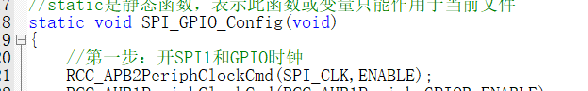

- SPI1外设使能
- 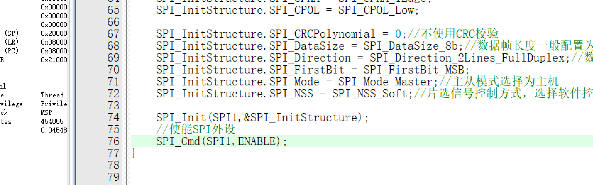

排查一圈，引脚复用什么的也没有问题

使用逻辑分析仪，发现没有任何波形，则SPI根本就没使能s

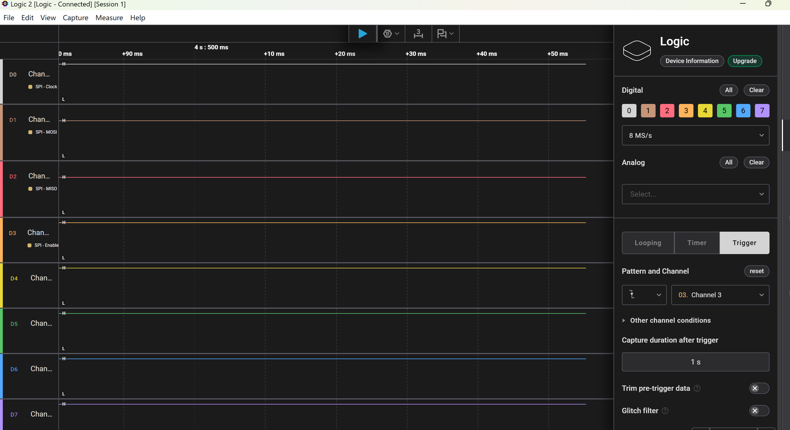

检查主函数发现没有调用SPI_FLASH_Init()函数

现在重新调用，

## flash_id读取出现0xff,不是预期的0x17

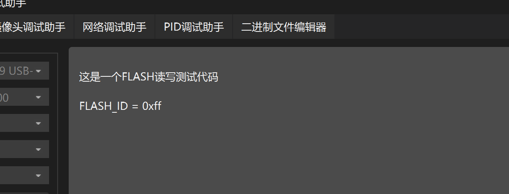

FLASH_ID读取出现错误，并不是预期的0xEF

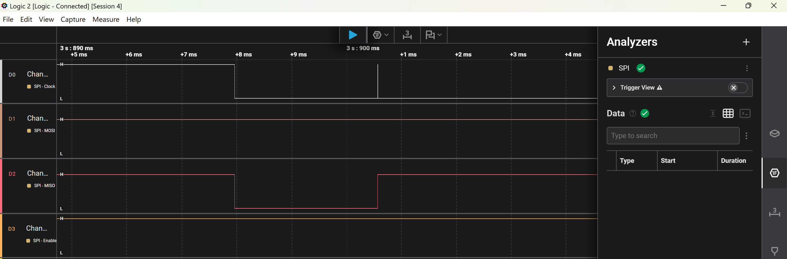

抓取波形图，发现CS片选信号一直都是高电平，说明没有被拉低

检查发现电平拉低函数已配置

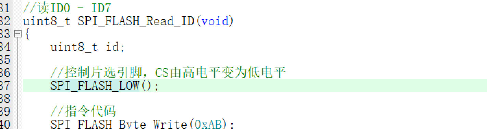

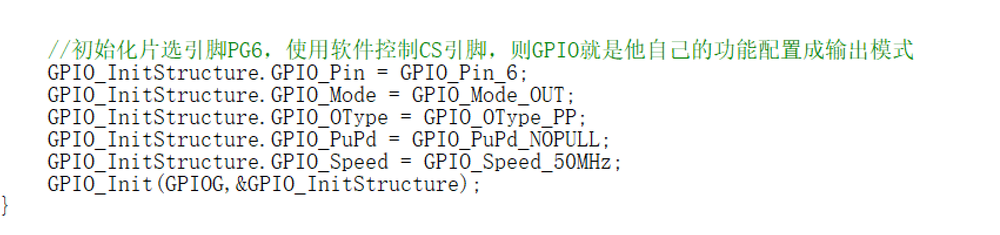

CS引脚配置也无问题

CS未拉低，有可能是SPI的问题

检查时钟配置发现没有打开GPIOG时钟

后增加打开GPIOG的时钟

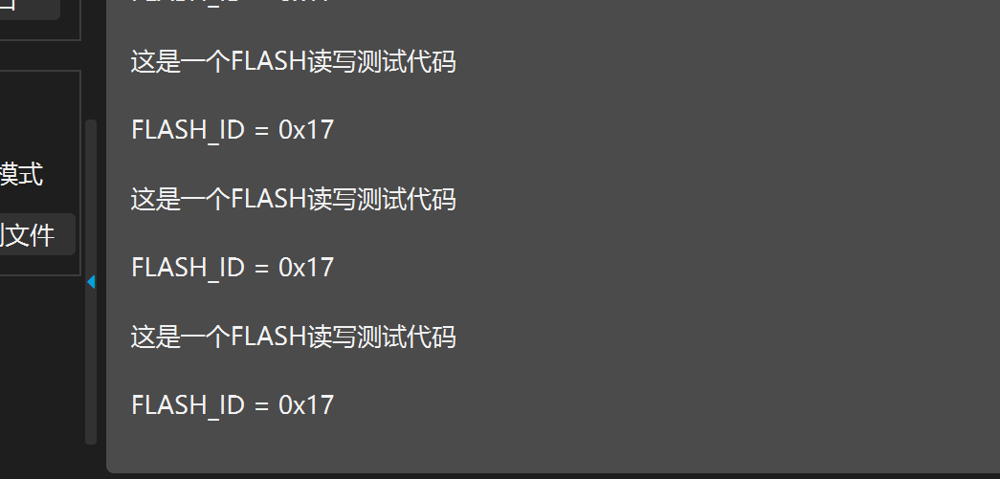

串口输出正常，可是波形图还是错误

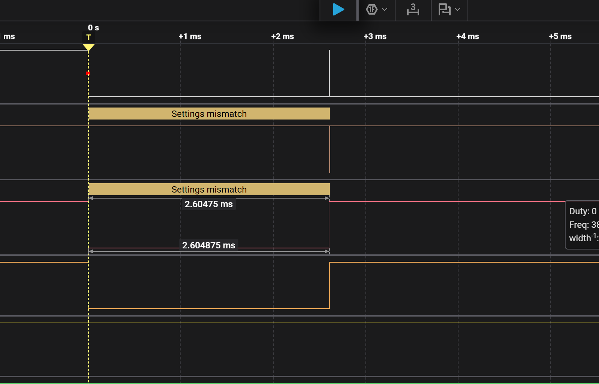

波形图分析：对应高电平

CPOL = 0，空闲时钟是低电平

CPOL = 1，空闲时钟是高电平

回去修改逻辑分析仪配置