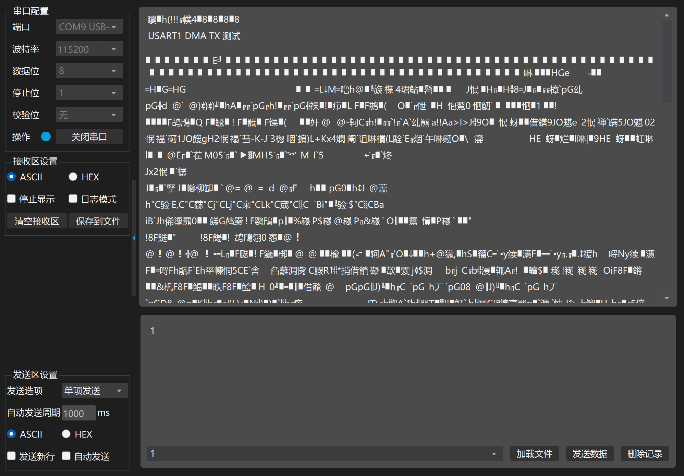

通过USB转串口，虽然LED灯在不断闪烁，数据也在一直发送，但是没有按照预期主函数这样子发送一堆'A'

错误排查

1. 正常现象部分：此时“USART1 DMA TX 测试能够正常发送”
2. 不正常数据出现时间：在“USART1 DMA TX 测试能够正常发送”之后出现一堆乱码

# 进入debug排查

**第一步**：先确认是不是“数据源出了问题

查看数据是否写进去了

**现象**：怀疑串口输出异常是因为发送缓冲区的数据不对

**验证**

在数据A发送完成之后设置断点

1. 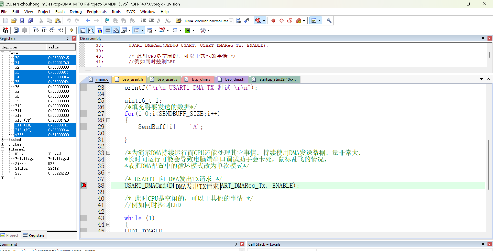

   

   结果说明数据A发送成功（说明内存数据完全正常）

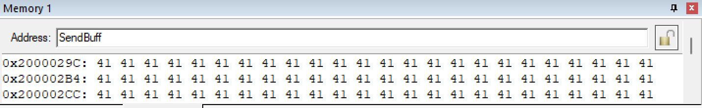

发现：

- 缓冲区数据是正常的
- 预期的 `A` 已经正确写入内存

结论：

​	说明数据源没有问题，则说明可能在DMA搬运数据过程或者USART串口发送数据过程

**第二步排查**：检查 DMA 是否读错地址

**验证**：

现在调出DMA2的数据流7窗口

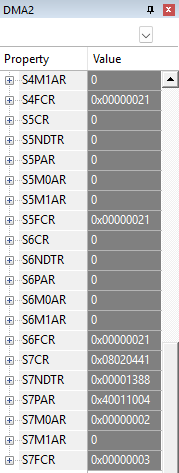

查看此时S7MA0R的真实地址，通过调取keil5的view，window中的watch1进行比对，发现此时地址不对则说明DMA_Memory0BaseAddr配置错误

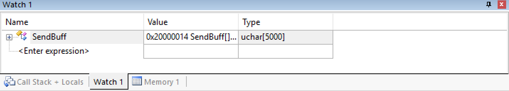

现在重新配置 

	/* 2. 设置数据源：内存缓冲区地址 */	
		DMA_InitStructure.DMA_Memory0BaseAddr = DEBUG_USART_DR_BASE;

**程序现象**：乱码问题明显消失。

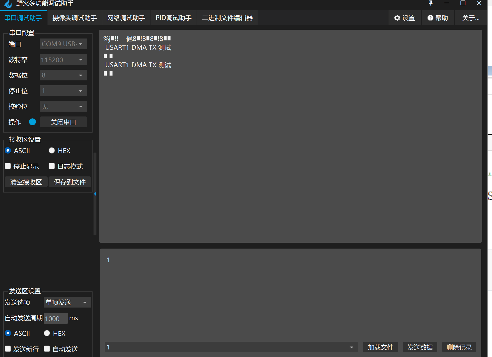

**结论**：

就是DMA直接发送空数据给串口，cpu还没有来得及填数据给DMA

最初的乱码确实是 DMA 内存基地址错误导致的。
这一步排除了“DMA 读垃圾内存”的死因。

**第三步排查**：检查 NDTR

为什么后面只剩 2 个空白数据（白色方块代表空白数据），而不是一堆‘A’

**验证**：

则可能是DMA 缓冲区长度配得太小就配置成2个了检查数据

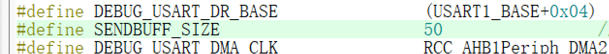

结论：重新将SENDBUFF_SIZE设置为5000,现象依然存在

 NDTR 计数器（NDTR表示还要传多少个数据单元）

**验证**：

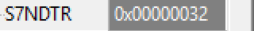

换算：0x32 = 50

DMA 实际加载的传输长度只有 50，不是预期的 5000。

回到头文件修改BuffSize为5000.

回debug验证

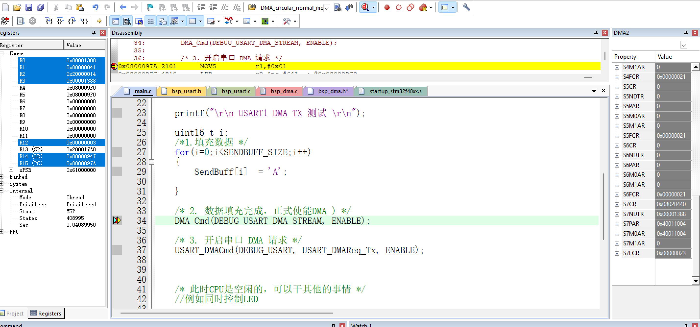

更改后的现象

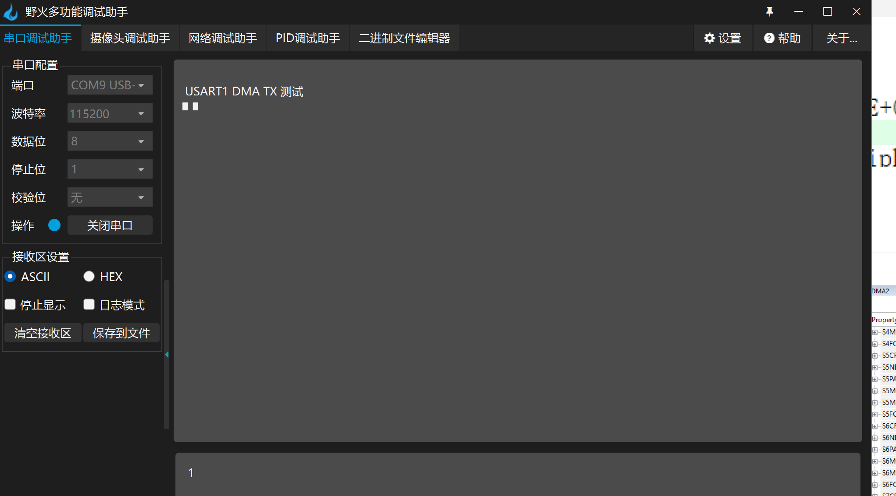

此时现象还是卡在“只有两个怪字符、没有满屏 A”，DMA 确实工作了（如果配置完全错误，1 个字符都发不出来）。

结论：

DMA 刚开始工作，计数器就扣减清零了，或者配置没写进去就被锁死了。

检查数据宽度没错，传输方向也对，内存地址自增，外设地址不自增也对，

第四步排查：继续检查代码发现两个配置成同样的地址了

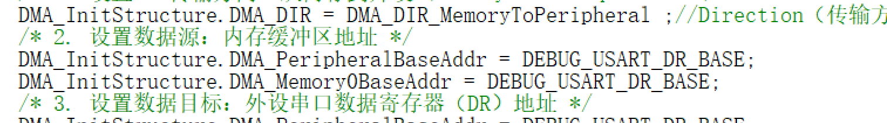

改完后断点设置在DMA_Cmd

发现源数据与SENDBUFF地址恰好相同

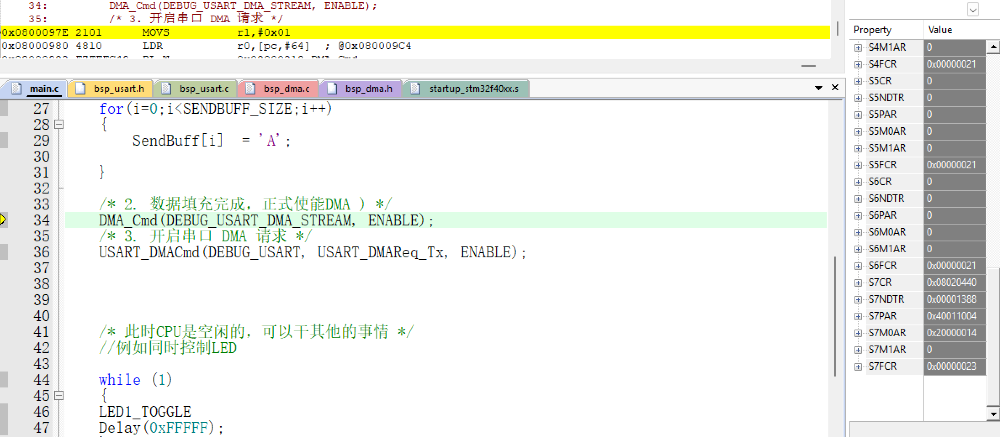

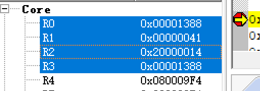

单步跨过DMA_Cmd（），发现S7CR由0变为1，说明DMA成功启动

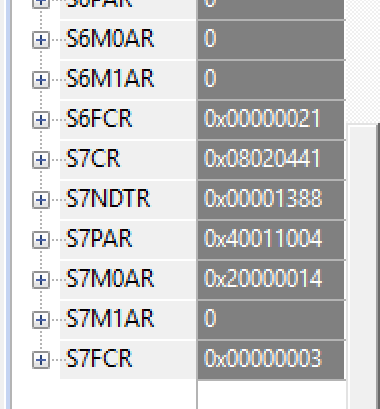

退出debug，程序运行成功一切正常

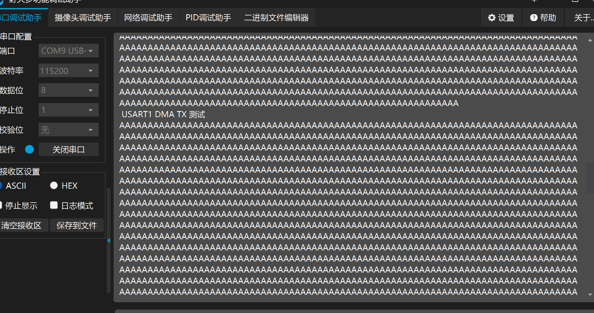