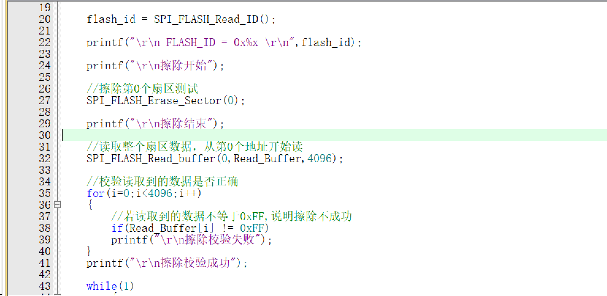
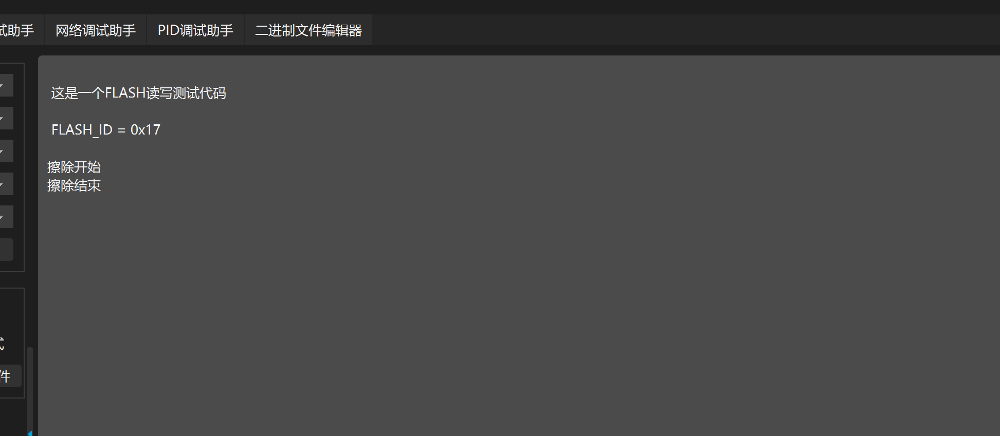
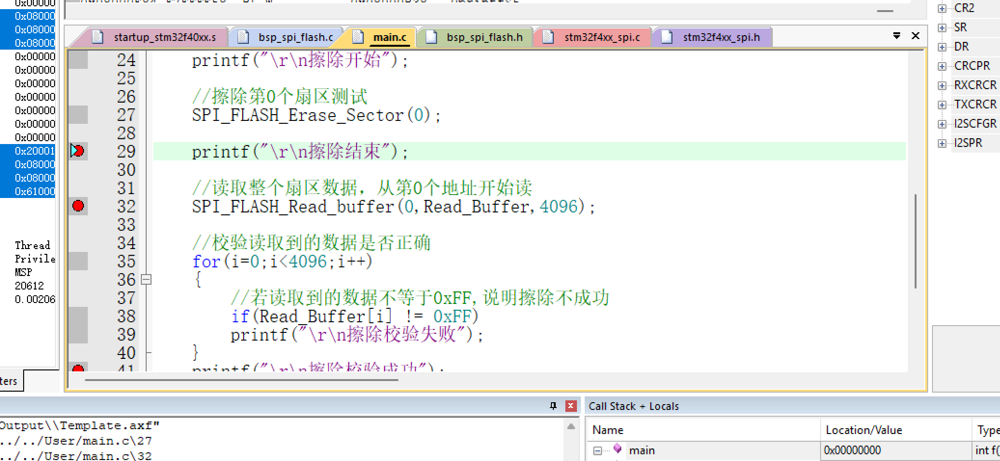
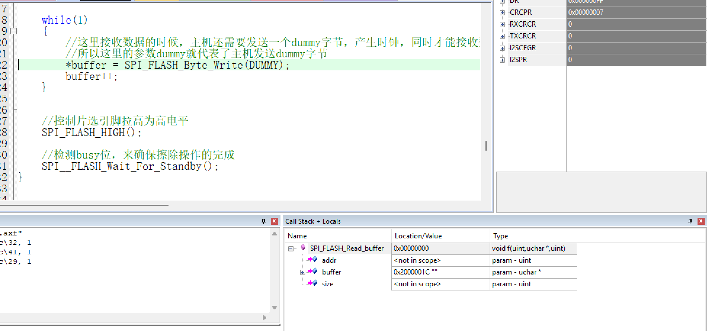
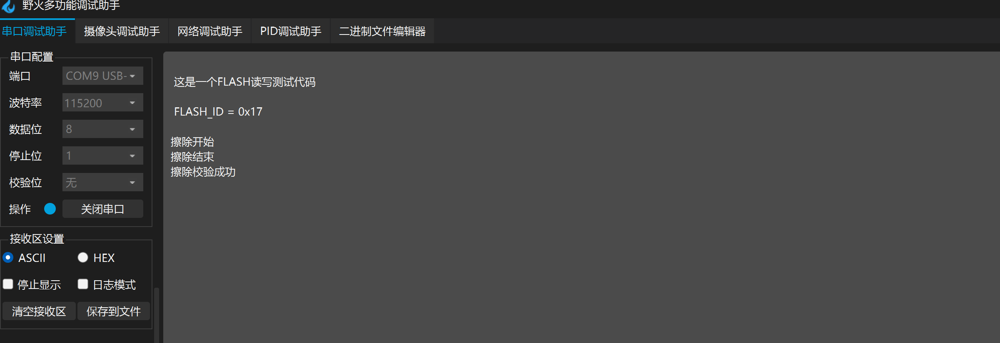

## 注意循环结束的条件

主程序

串口打印的数据

现象分析：缺少了擦除校验成功，应该是读取flash扇区卡死

操作：将读取扇区的操作进行注释

后续串口输出正常，说明就是读取扇区的操作出现问题了

进入debug

设置3个断点，全速运行到擦除结束都没问题，说明前面的操作没有问题

观察发现buffer的值有变化,不过size的值没变化发现是size的问题

现在重新修改，串口输出正常

